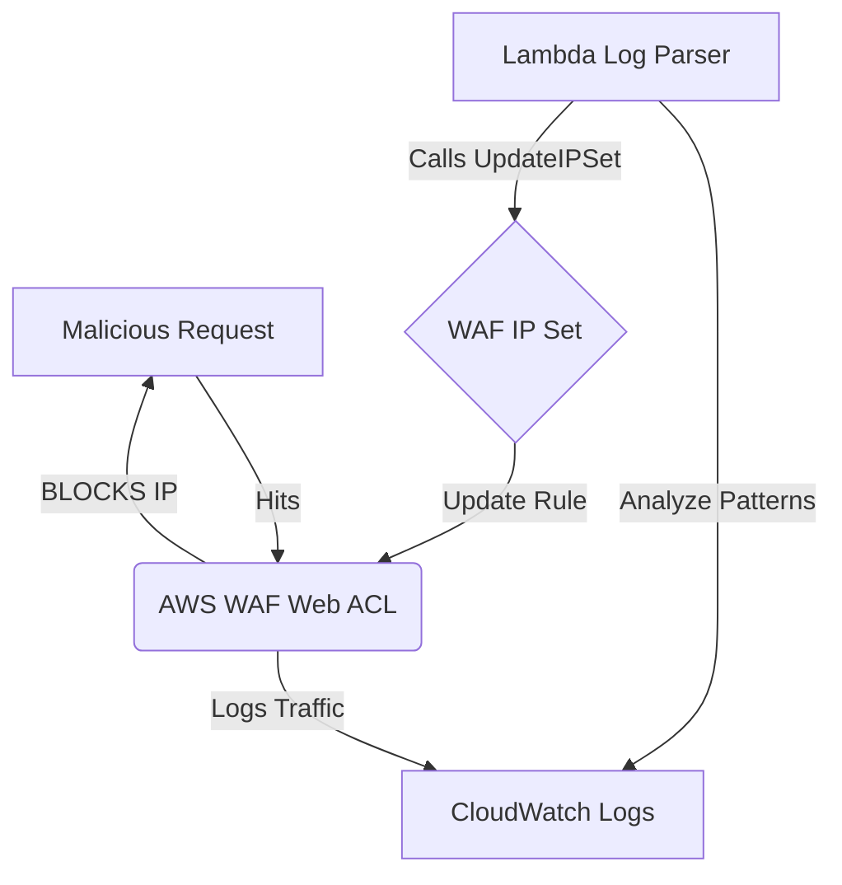

# AWS WAF Automated Malicious IP Blocker

## 🛡️ Project Overview
This project demonstrates **Automated Incident Response (IR)** in a cloud-native environment. I built a serverless system that programmatically updates an AWS WAF (Web Application Firewall) IP Set to block malicious actors instantly without human intervention.

## 🏗️ Architecture Diagram

## 🛠️ Security Features
- **Least Privilege IAM**: The Lambda role is restricted only to the specific IP Set resource.
- **Concurrency Control**: Utilizes the AWS `LockToken` mechanism to prevent race conditions during IP Set updates.
- **Serverless Architecture**: Zero infrastructure to manage, reducing the operational attack surface.

## 🔧 Technical Skills
- **AWS SDK (Boto3)**: Programmatic firewall management.
- **JSON Policy Design**: Custom IAM role construction.
- **Event-Driven Security**: Leveraging Lambda for real-time remediation.
